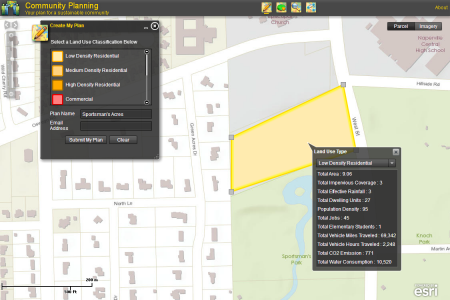

# community-planning

***This Community Planning repo is no longer being monitored, applications built from this repo are in mature support***

The Community Planning application can be used by citizens and other interested parties to create, analyze, and share
land use goals and aspirations for their community during a master planning process. The application helps citizens
create different implementation plans, evaluate their impact and shape the future of their community.

[]

## Features

Widgets
* Create My Plan
* Community Impact
* Review My Plan
* Share My Plan

## Instructions

### Your Services

[Detailed help](http://solutions.arcgis.com/local-government/help/community-planning/)
on the ArcGIS Solutions site can guide you in the setup and configuration of the app with your data.

### General Help
[New to Github? Get started here.](http://htmlpreview.github.com/?https://github.com/Esri/esri.github.com/blob/master/help/esri-getting-to-know-github.html)

## Requirements

* Microsoft ASP.NET Framework 4.0 available from the [Microsoft website](http://www.microsoft.com/en-us/download/details.aspx?id=17851)
* Adobe Flash Player Plug-in - [About](http://get.adobe.com/flashplayer/)

### Your Services

* ArcGIS for Desktop 10.2 - Standard or Advanced - [About](http://www.esri.com/software/arcgis/arcgis-for-desktop)
* ArcGIS for Server 10.2 - Standard or Advanced - [About](http://www.esri.com/software/arcgis/arcgisserver)
* Local Government Information Model - [About](http://www.arcgis.com/home/item.html?id=ae175b36c4154dda987127dff879350d)
* Microsoft ASP.NET Framework 4.0 available from the [Microsoft website](http://www.microsoft.com/en-us/download/details.aspx?id=17851)
* Adobe Flash Player Plug-in - [About](http://get.adobe.com/flashplayer/)

## Resources

Learn more about Esri's [ArcGIS for Local Government maps and apps](http://solutions.arcgis.com/local-government/).

Show me a list of other [Local Government GitHub repositories](http://esri.github.io/#Local-Government).

Additional [information](http://solutions.arcgis.com/local-government/help/community-planning/)
are available for the application.

This application uses the 3.5 version of
[Esri's ArcGIS API for Flex](http://resources.arcgis.com/en/communities/flex-api/)
and the 4.6 version of [Adobe's Flex SDK](http://www.adobe.com/devnet/flex/flex-sdk-download.html);
see the ArcGIS API site for concepts, samples, and a reference for using the API to create mapping web sites.

## Issues

Find a bug or want to request a new feature?  Please submit an issue. This Community Planning repo is no longer being monitored, applications built from this repo are in mature support

## Contributing

Esri welcomes contributions from anyone and everyone.
Please see our [guidelines for contributing](https://github.com/esri/contributing).

## Licensing

Copyright 2013 Esri

Licensed under the Apache License, Version 2.0 (the "License");
you may not use this file except in compliance with the License.
You may obtain a copy of the License at

   http://www.apache.org/licenses/LICENSE-2.0

Unless required by applicable law or agreed to in writing, software
distributed under the License is distributed on an "AS IS" BASIS,
WITHOUT WARRANTIES OR CONDITIONS OF ANY KIND, either express or implied.
See the License for the specific language governing permissions and
limitations under the License.

A copy of the license is available in the repository's
[LICENSE.txt](LICENSE.txt) file.

